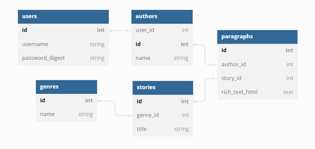

# Storyteller<a id="top"></a>
Storyteller is a turn-based creative writing app using React, Rails, Postgresql, BCrypt, and is hosted on Heroku.

## Final Project Requirements
This app was made to fulfill project requirements for Flatiron School Software Engineering Phase 5 Final Project.
These requirements that have been met or surpassed are:
* Include a many to many relationship.
* Implement a minimum of 4 models.
* Implement a minimum of 5 client side routes using React router.
* Implement password protection and authentication.
* Include full CRUD on at least 1 model, following REST conventions.
* Implement validations and error handling.
* Implement something new not taught in the curriculum. * Implement useContext or Redux.


## Table of Contents
---
* [Requirements](#dep)
* [Setup](#start)
* [Configuration](#config)
* [Media](#media)
* [API Endpoints](#api-doc)
* [License](#license)


## Requirements<a id="dep"></a>
---

[Back to Top](#top)

### API
Technologies:
* ruby        v2.7.4
* rails       v7.0.3
* postgresql  v14.5

Gems:
* puma        v5.0
* bcrypt      v3.1.7
* rack-cors

### __Client__
Dependencies for the Client are located in ```"./client/package.json"```.
#### React & React Router
* react               v^18.2.0
* react-dom           v^18.2.0
* react-router-dom    v^6.3.0
* react-scripts       v5.0.1
#### Material UI & Styled Components
* @emotion/react      v^11.10.0
* @emotion/styled     v^11.10.0
* @mui/icons-material v^5.8.4
* @mui/material       v^5.10.1
* styled-components   v^5.3.5
#### DraftJS
* draft-js            v^0.11.7
* draft-js-export-html v^1.4.1


## Setup<a id="start"></a>
---
Once you have the correct versions of Ruby, Rails, React, and PostGresQl set up,
1. Fork and clone this repo
```
git clone git@github.com:matthewkohn/storyteller.git your-storyteller-app-name
cd your-storyteller-app-name
git remote rm origin
```
2. Create a new repository on GitHub, connect it to your local repository, and push up your code.
```
git remote add origin git@github.com:your-username/your-storyteller-app-name.git
push -u origin main
```
3. Install dependencies
```
bundle install
npm install --prefix client
```
4. Create & Start the PostGresQl server with
```
rails db:create db:migrate db:seed
sudo service postgresql start  
```
_(you may be prompted for your password to start )_

5. Once PostGresQl server starts successfully, start the server:
```
rails s
```
and in a separate terminal run
```
npm start --prefix client
```
Your client should start in http://localhost:4000

---

## Configuration<a id="config"></a>
[(back to top)](#top)

The Rails API is configured to run locally on PORT:3000.
The client is stored under ```'./client'``` and runs locally on PORT:4000. Make sure you have dependencies installed before forking and cloning.

This app is also configured to allow ActionDispatch::Session::CookieStore cookies & session middleware, as well as use SameSite=Strict for all cookies to protect against CSRF.


## Media<a id="media"></a>
[(back to top)](#top)
### Youtube demonstration of how the app works [here](https://youtu.be/5FGV2X0oCjo)


### DB Diagram describing model relationships:



## API Documentation<a id="api-doc"></a>
[(back to top)](#top)
Below are API methods, endpoints, and the expected JSON response format for each.

* [GET](#get)
* [POST](#post)
* [PATCH](#patch)
* [DELETE](#delete)

### GET requests<a id="get"></a>
```/genres```
```
[
    {
        "id": 1,
        "name": "Sci-Fi"
    },
    {
        "id": 2,
        "name": "Suspense"
    },
    {
        "id": 3,
        "name": "Action Adventure"
    },
    .....
    .....
]
```
```/authors```
```
[
    {
        "id": 1,
        "name": "Matt Kohn"
    },
    {
        "id": 2,
        "name": "Jonathan Swift"
    },
    {
        "id": 3,
        "name": "Tyler Parrayo"
    },
    .....
    .....
]
```
```/stories```
```
[
    {
        "id": 1,
        "title": "Planet Paralax"
    },
    {
        "id": 2,
        "title": "The Parking Meter"
    },
    {
        "id": 3,
        "title": "Vacation in Thailand"
    },
    .....
    .....
]
```
```/stories/:id```
```
{
    "id": 1,
    "title": "Planet Paralax",
    "genre": "Sci-Fi",
    "paragraphs": [
        {
            "id": 6,
            "rich_text_str": "<p><strong>Out of nowhere, a huge rock fell from the sky and crushed Clorax.</strong></p>\n<p><br/></p>\n<p><em>Squish</em></p>\n<p><br/></p>\n<p>Clorax turned into a puddle, and let the boulder pass right through her liquid form. The impact from the rock colliding with the earth propelled Clorax upwards into the sky, where she was able to re-solidify and shift into physical form with wings.</p>\n<p><br/></p>\n<p>She glided quickly towards her brother. Once she caught up with him, she stopped him and said, \"We have to go back for the backpack I dropped.\"</p>\n<p><br/></p>",
            "created_at": "2022-10-05T18:21:28.853Z",
            "author": "Matt Kohn"
        },
        {
            "id": 8,
            "rich_text_str": "<p>We'll have to come back to find it. Right now we need to get up to the control room to turn off the <em>terraforming engine</em>!</p>",
            "created_at": "2022-10-05T18:33:07.792Z",
            "author": "Tyler Parrayo"
        },
        .....
        .....
]
```


### POST requests<a id="post"></a> [(back)](#api-doc)
1. Logging in or Signing up

```/login```
```
{
    "username": "Matt",
    "password": "happy"
}
```
```/signup```
```
{
    "username": "test4",
    "password": "happy",
    "password_confirmation": "happy"
}
```
Response from API:
```
{
    "id": 1,
    "username": "Matt Kohn",
    "password_digest": "$2a$12$MfRriWM/5jg0akL3t61HZuRi1pYGKBu.QL2sBjLVBf3etI3.cU6fq",
    "created_at": "2022-10-05T18:00:38.775Z",
    "updated_at": "2022-10-05T18:00:38.775Z"
}
```
2. Creating new authors

```/authors```
```
{
    "name": "Tiger Woods"
}
```
Response from API:
```
{
    "id": 13,
    "name": "Tiger Woods"
}
```
3. Creating new stories

```/stories```
```
{
    "genre_id": 1,
    "title": "postman test2"
}
```

```/stories/:id/paragraphs/:id```
```
{
    "author_id":4,
    "rich_text_str": "<h1>My name is AWESOME.</h1>"
}
```


### PATCH requests<a id="patch"></a> [(back)](#api-doc)
```/stories/:id/paragraphs/:id```
```
{
    "author_id":4,
    "rich_text_str": "<h1>My paragraph is super cool.</h1>"
}
```

### DELETE requests<a id="delete"></a> [(back)](#api-doc)
Logging out response with: ```/logout```
```
{
    "error": "Successfully logged out"
}
```
Delete paragraph response with ```/stories/:id/paragraphs/:id```
```
{
    "id": 28,
    "rich_text_str": "<h4><em>Here you go!</em></h4>",
    "created_at": "2022-10-06T15:00:12.816Z",
    "author": "New Name"
}
```

## License <a id="license"></a>
[Read the license here](./LICENSE)

##### [Back to Top](#top)